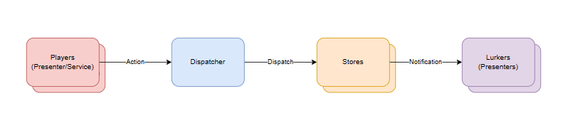
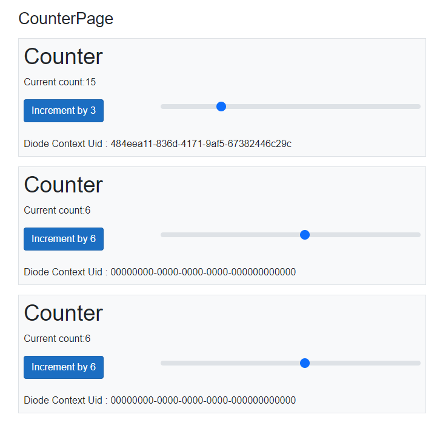

# Blazr.Diode

Diode is a simple async unidirectional state management implementation based on the **Flux** pattern.




Players, such as Presentation layer services, Views or backend services create an `Action` instance, populate it with the relevant data and *Dispatch* to the `Dispatcher`.

The dispatcher manually injects the handler that matches the store type and action type, sets the action instance and passes the `MutateAsync` as a `DiodeMutationDelegate` to the store.

The store executes the delegate, returns a `DiodeMutationResult` and raises the `StateHasChanged` to notify any listeners.


The accompanying project demonstrates a simple  `Counter` page implementation.

## CounterData

`CounterData` is the state object.

```csharp
public record CounterData
{
    public int Counter { get; init; }
}
```

## CounterIncrementAction

`CounterIncrementAction` defines the data we need to effect the increment mutation.  In this case it just defines the amount to increment the value by.  It must implement `IDiodeAction`.  

```csharp
public record CounterIncrementAction : IDiodeAction
{
    public string Name => "Increment Counter by x";

    public int IncrementBy { get; init; } = 1;    
}
```

## CounterIncrementHandler

Each Action requires a handler that implements `IDiodeHandler`.

```csharp
public class CounterIncrementHandler : IDiodeHandler<CounterData, CounterIncrementAction>
{
    public CounterIncrementAction Action { get; set; } = default!;

    public Task<DiodeMutationResult<CounterData>> MutateAsync(DiodeMutationRequest<CounterData> request)
    {
        ArgumentNullException.ThrowIfNull(Action);

        var result = request.Item with { Counter = request.Item.Counter + Action.IncrementBy };
        return Task.FromResult( DiodeMutationResult<CounterData>.Success(result));
    }
}
```

Handlers are Transient based services.

`CounterIncrementHandler` implements `IDiodeHandler`.

`MutateAsync` applies the mutation.  It takes data provided in the action and creates a new `CounterData` instance.

```csharp
public class CounterIncrementHandler : IDiodeHandler<CounterData, CounterIncrementAction>
{
    public CounterIncrementAction Action { get; set; } = default!;

    public Task<DiodeMutationResult<CounterData>> MutateAsync(DiodeMutationRequest<CounterData> request)
    {
        ArgumentNullException.ThrowIfNull(Action);

        var result = request.Item with { Counter = request.Item.Counter + Action.IncrementBy };
        return Task.FromResult(DiodeMutationResult<CounterData>.Success(result));
    }
}
```

## Services

The services are declared in a `IServiceCollection` extension method.

```csharp
public static class CounterServices
{
    public static void AddCounterServices(this IServiceCollection services)
    {
        services.AddScoped<DiodeStore<CounterData>>();
        services.AddScoped<DiodeDispatcher>();
        services.AddTransient<IDiodeHandler<CounterData,CounterIncrementAction>, CounterIncrementHandler>();
    }
}
```

And added to `Program`:

```csharp
builder.Services.AddServerSideBlazor();
builder.Services.AddSingleton<WeatherForecastService>();
builder.Services.AddCounterServices();
```

## Counter



```csharp
@page "/counter"
@using Blazr.Diode.Server.Web.Counter;

@inject DiodeStore<CounterData> Store
@inject DiodeDispatcher Dispatcher

<PageTitle>Counter</PageTitle>

<h1>Counter</h1>

<p role="status">Current count: @Store.Item.Counter</p>
<div class="row">

    <div class="col-12 col-sm-6 col-md-4 mb-3">
        <button class="btn btn-primary" @onclick="IncrementCount">@_action.Name</button>
    </div>

    <div class="col-12 col-sm-6 col-md-8 mb-3">
        <input class="form-range" type="range" min="1" max="10" @bind=_range @bind:after="this.RangeChanged" />
    </div>

</div>

@code {
    private CounterIncrementAction _action = new CounterIncrementAction() { IncrementBy = 1 };
    private int _range = 1;

    private async Task IncrementCount()
    {
        await Dispatcher.DispatchAsync<CounterData, CounterIncrementAction>(_action);
    }

    private void RangeChanged()
    {
        _action = new CounterIncrementAction() { IncrementBy = _range };
    }
}
```